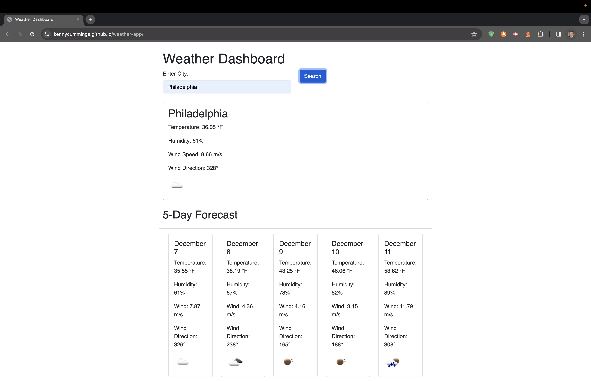
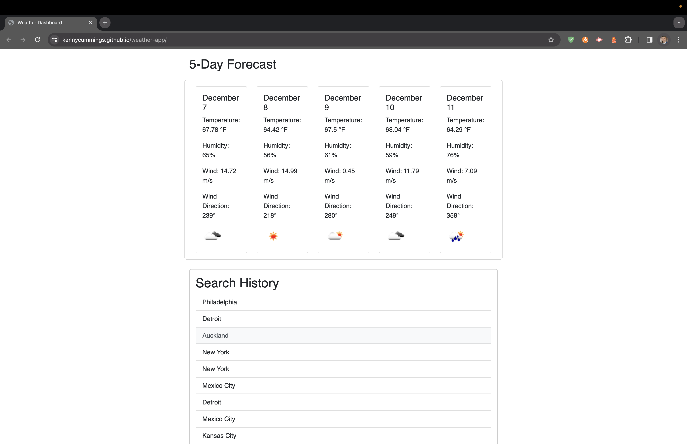
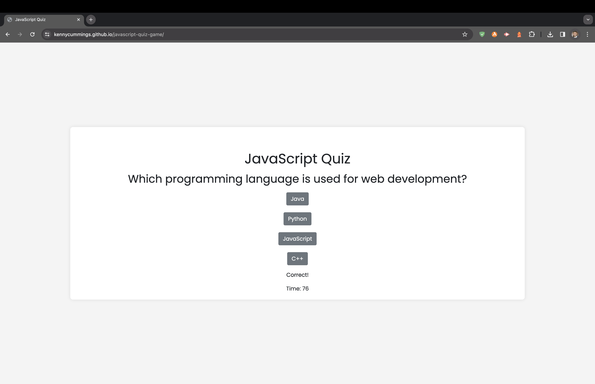
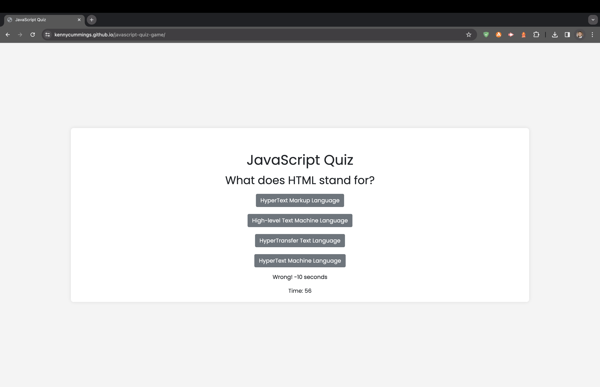
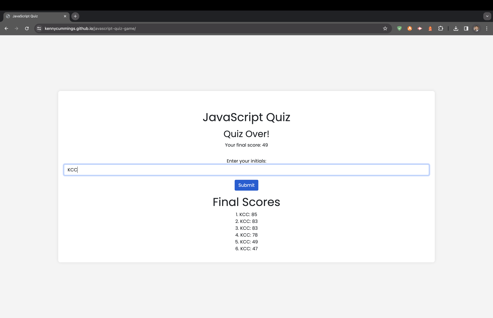

# weather-app

This weather app allows users to check the current weather and a 5-day forecast for a given city. It utilizes the OpenWeatherMap API to fetch weather data. The application is built using HTML, CSS, and JavaScript with the help of jQuery, Bootstrap, and Day.js.

## Features

Current Weather: Displays the current temperature, humidity, wind speed, wind direction, and a weather icon.

5-Day Forecast: Displays a 5-day forecast with the same details as current weather for each day.

Search History and Local Storage: Keeps track of the user's search history and provides a clickable list of past cities that instantly updates the page.

## Functionality

To use, enter the name of a city in the input field and click the "Search" button to display the current weather and 5-day forecast on the page.

Previously searched cities are listed in a history. Clicking on a city in the history will display its weather information.

 

Web Application URL: https://kennycummings.github.io/weather-app
 
 
Screenshots of Application:
 
 

 
 

 
 

 
 

 
 

